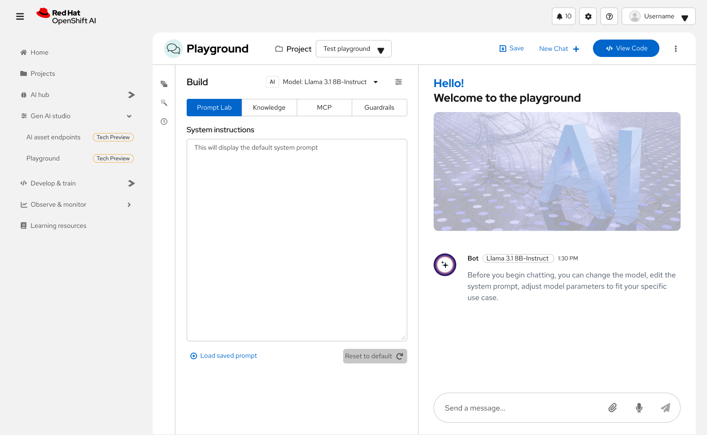
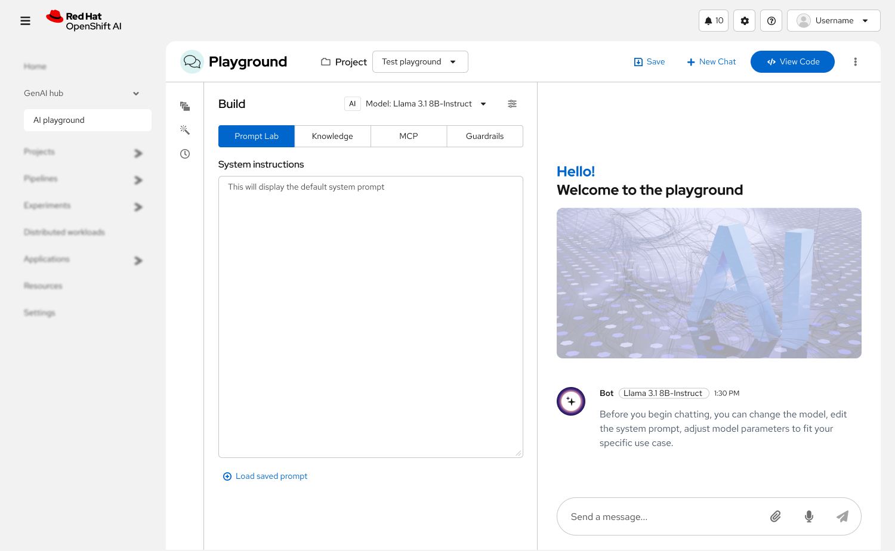
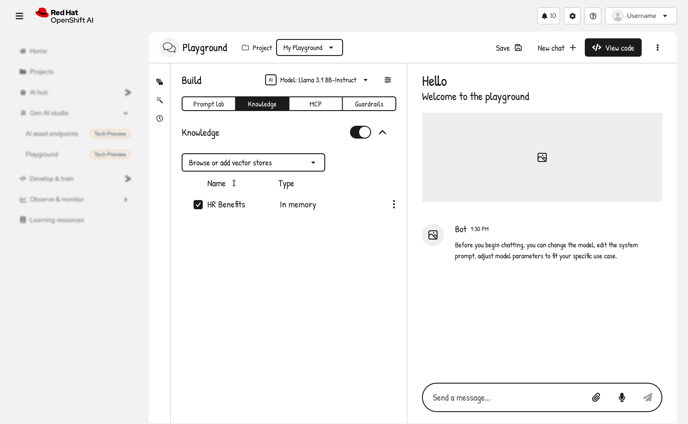
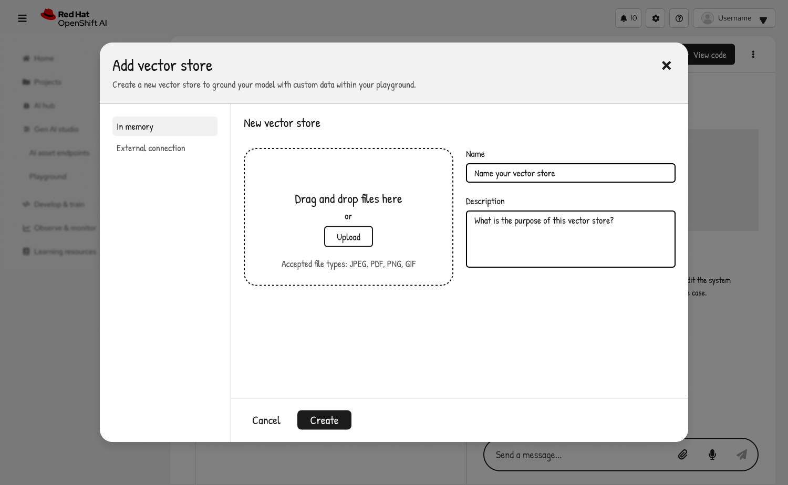
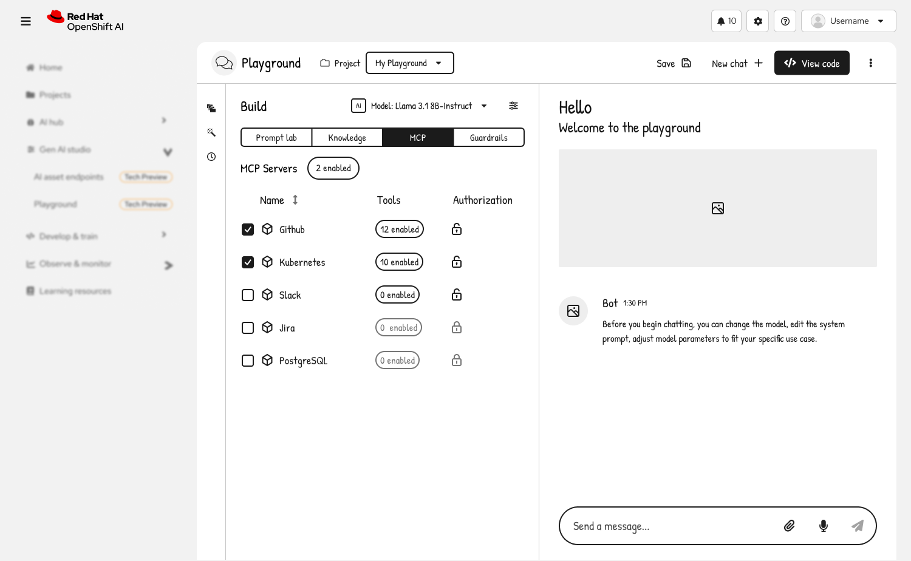
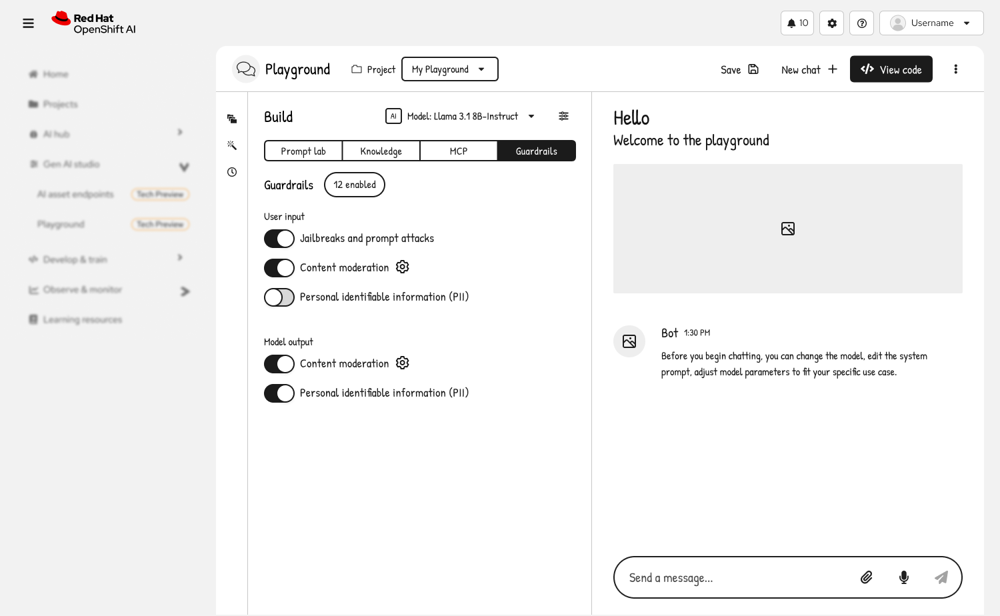
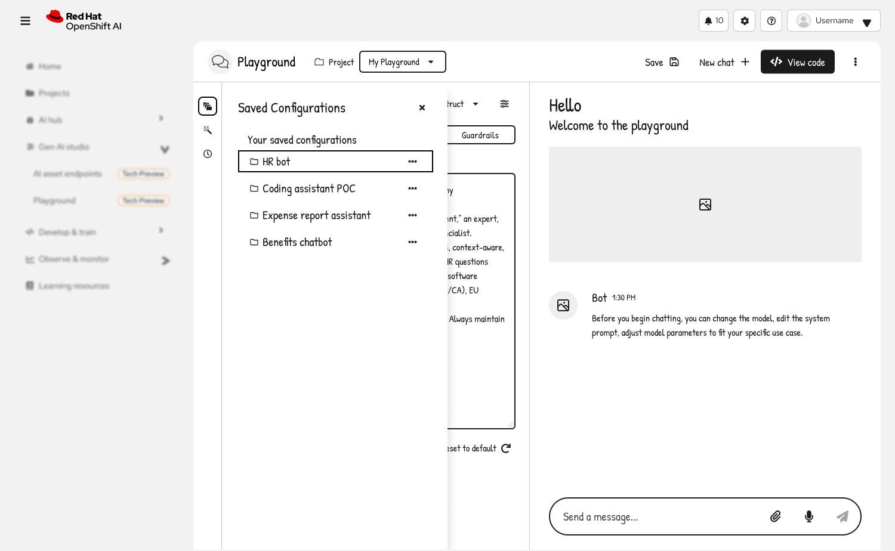
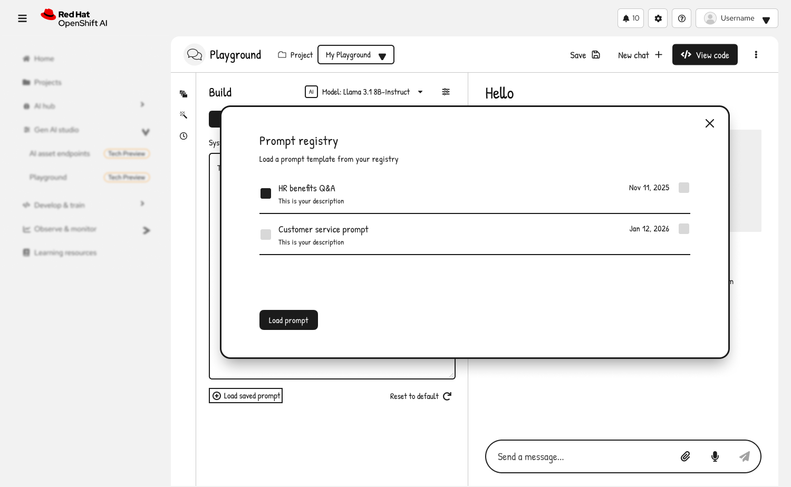

# RHOAI 3.4 Prototype Enhancement Plan

## Phase 1: Playground (AgentBuilder) Updates

The Playground route `/gen-ai-studio/playground` uses [`src/app/GenAIStudio/AgentBuilder/AgentBuilder.tsx`](src/app/GenAIStudio/AgentBuilder/AgentBuilder.tsx).

### Reference Wireframes



*Figure 1: Playground with Build panel showing Prompt Lab tab and chat interface*

**Current implementation** (as shown in the UI):

- On left, add a build panel with toggle group: Prompt, Knowledge, MCP, Guardrails
- System instructions textarea in Prompt
- Move chat interface using PatternFly Chatbot component to the right
- Header with Save, New Chat, and View Code buttons
- Project selector dropdown
- Model selector (showing "Llama 3.1 8B-Instruct" in the example)
- Model parameter icon button that opens a menu with parameter controls like temperature

- **Enhanced Build panel tabs**
  - **Prompt tab** (currently has basic system instructions):



*Figure 2: Prompt Lab tab showing system instructions textarea*

    - Add prompt templates library with categories
    - Support for variables/placeholders (e.g., {{variable}})
    - Prompt versioning and history
    - Quick actions: clear, reset to default, load saved
  - **Knowledge tab** (as shown in wireframes):



*Figure 3: Knowledge tab showing vector stores management*

    - Toggle switch to enable/disable Knowledge (RAG)
    - Dropdown: "Browse or add vector stores"
      - Lists existing vector store connections
      - Option to create new vector store
    - Vector stores table showing:
      - Checkbox column for selection
      - Name column (sortable)
      - Type column (In memory, External connection, etc.)
      - Actions menu (kebab menu) for each store with option to edit or remove store
    - Selected vector stores are used for RAG grounding

  - **Add Vector Store Modal** (triggered from Knowledge tab):



*Figure 4: Add vector store modal with file upload and configuration options*

    - Modal header: "Add vector store"
    - Subtitle: "Create a new vector store to ground your model with custom data within your playground."
    - Left sidebar with vector store types:
      - "In memory" (default selection)
      - "External connection"
    - Main form area for "In memory" type:
      - **File Upload Section**:
        - Drag-and-drop zone with dashed border
        - "Upload" button
        - Accepted file types: JPEG, PDF, PNG, GIF
        - File upload progress indicators
        - List of uploaded files with remove option
      - **Name field**: Text input "Name your vector store"
      - **Description field**: TextArea "What is the purpose of this vector store?"
      - **Advanced settings** (expandable section):
        - Embedding model selector dropdown
        - Chunk size slider/input (default 512)
        - Chunk overlap slider/input (default 50)
        - Chunking strategy dropdown (fixed, semantic, etc.)
    - Main form area for "External connection" type:
      - Connection selector from existing connections
      - Option to create new connection
      - Connection-specific configuration
    - Modal footer:
      - "Cancel" button (secondary)
      - "Create" button (primary)
    - Form validation before creation
  - **MCP tab** (as shown in wireframe):



*Figure 5: MCP tab showing server list with authorization and tool management*

    - Header: "MCP Servers" with badge showing count of enabled servers (e.g., "2 enabled")
    - Table with columns:
      - **Name** (with checkbox and server icon)
      - **Tools** (shows count of enabled tools)
      - **Authorization** (lock icon indicator)
    - List of available MCP servers:
      - Github, Kubernetes, Slack, Jira, PostgreSQL, etc.
      - Each row shows server name, enabled tool count, and auth status

**Interactions:**

    - **Checkbox click**: 
      - Launches "Add Authorization" modal
      - User enters authentication token/credentials
      - Modal validates and saves authorization
      - Server becomes enabled after successful auth
    - **Tool count label click** (e.g., "12 enabled"):
      - Opens "Select Tools" modal
      - Shows all available tools for that MCP server
      - Checkboxes to enable/disable specific tools
      - "Select All" / "Deselect All" options
      - Save button to apply tool selection
      - Updates tool count badge after save
    - **Lock icon click**:
      - Reopens authorization modal
      - Shows current auth status (masked token/credentials)
      - Options:
        - Update/edit authorization
        - "Clear authorization" button (destructive)
        - Cancel to keep existing auth
      - Clearing auth disables the server and unchecks it

### 1.2 Right Sidebar Configuration Panel

Based on the latest wireframes, the playground uses a **right sidebar panel** for configuration (not tabs in the Build section). The sidebar contains collapsible sections:

- **RAG Section**
  - Toggle switch to enable/disable RAG
  - Chevron to expand/collapse additional RAG settings
  - When expanded: shows connected vector stores and configuration

- **MCP Servers Section**
  - Chevron to expand/collapse
  - When collapsed, shows how many MCP servers are enabled
  - When expanded: shows list of enabled MCP servers with management options

- **Guardrails Section** (as shown in screenshot)



*Figure 6: Guardrails configuration panel showing user input and model output filtering options*

  - Header: "Guardrails" with badge showing count (e.g., "5 enabled")
  - Chevron to expand/collapse section
  - When expanded, shows nested configuration:

**Model subsection:**

  - Dropdown to select which model to apply guardrails to
  - Example: "mistral-7b-instruct"

**User input subsection:**

  - Title: "User input"
  - Toggle switches for guardrail categories:
    - **"Jailbreaks and prompt attacks"** 
      - Toggle with info icon tooltip
      - When enabled, blocks prompt injection attempts
    - **"Content moderation"** 
      - Toggle with info icon tooltip
      - When enabled, shows expandable checklist of subcategories:
        - ☑ Toxicity / Hate Speech
        - ☑ Sexual Content
        - ☑ Violence / Self Harm
        - ☑ Harassment
      - Individual checkboxes can be toggled on/off
      - Unchecking all disables content moderation
    - **"Personal identifiable information (PII)"**
      - Toggle with info icon tooltip
      - When enabled, detects and blocks/masks PII in user inputs

**Model output subsection:**

  - Title: "Model output" (visible at bottom of screenshot)
  - Similar guardrail options for filtering model responses
  - Mirror structure of User input section

**Interactions:**

  - Clicking info icons shows tooltip with guardrail description
  - Toggling top-level switch enables/disables entire category
  - Expanding Content moderation reveals granular checkboxes
  - Changes apply immediately to next message
  - Badge count updates as guardrails are enabled/disabled

### 1.3 Advanced Configuration & Settings

- **Model configuration drawer**
  - Accessible via settings icon or model selector
  - Temperature slider (0-2) with preset values
  - Top-p (nucleus sampling) slider (0-1)
  - Max tokens input field
  - Frequency penalty (-2 to 2)
  - Presence penalty (-2 to 2)
  - Stop sequences input
  - Response format selector (text/JSON/structured)

- **Saved Configurations Management** (as shown in wireframe)
  - **Left navigation rail icons**:
    - Saved configurations icon (folder/save icon)
    - Sample prompts icon (lightbulb or template icon)
    - Chat history icon (clock or list icon)

  - **Saved Configurations Drawer** (opens from nav rail):



*Figure 7: Saved configurations drawer showing list of saved playground configurations*

    - Drawer header: "Saved Configurations" with close button (X)
    - Section label: "Your saved configurations"
    - List of saved configuration items:
      - Each shows configuration name (e.g., "HR bot", "Coding assistant POC")
      - Folder icon prefix for each item
      - Kebab menu (three dots) for actions per configuration:
        - Load/Apply configuration
        - Rename
        - Duplicate
        - Delete
        - Export as JSON
    - Hover state highlights configuration row
    - Click on configuration name or row to load it
    - Footer: "Reset to default" button (with refresh icon)
      - Clears all current settings back to defaults
      - Confirmation dialog before reset

  - **Configuration Loading Behavior**:
    - When configuration is selected, apply all saved settings:
      - Model selection
      - System prompt from Prompt Lab
      - Knowledge sources and RAG settings
      - MCP servers and tool selections
      - Guardrails configuration
      - Model parameters (temperature, etc.)
    - Show toast notification: "Configuration '[name]' loaded"
    - Update Build panel to reflect loaded settings
    - Clear current chat or prompt to start new conversation

  - **Sample Prompts Drawer** (opens from nav rail):



*Figure 8: Sample prompts drawer with categorized prompt templates*

    - Similar drawer interface
    - Categories: Code, Writing, Analysis, Q&A, etc.
    - Built-in prompt templates
    - Click to insert into system instructions

  - **Chat History Drawer** (opens from nav rail):
    - List of previous conversations
    - Shows date, first message preview, model used
    - Click to load conversation
    - Search/filter by date or content

### 1.3 Enhanced Chat & Conversation Features

- **Save functionality** (button exists but needs implementation)
  - Save conversations with metadata
  - Auto-save drafts
  - Conversation browser/history modal
  - Tags and notes for saved conversations

- **View Code implementation** (button exists)
  - Generate API call code snippets
  - Support Python, JavaScript/TypeScript, cURL, Java
  - Include current configuration (model, parameters, knowledge sources)
  - Copy-to-clipboard with syntax highlighting
  - Show equivalent REST API request/response format

- **Chat enhancements**
  - Regenerate last response
  - Edit user messages and resubmit
  - Branch conversations from any point
  - Message actions: copy, delete, rate (thumbs up/down)
  - Token count display per message
  - Response time and cost estimation
  - Streaming response indicator
  - Stop generation button during streaming

## Phase 2: AutoRAG Feature Implementation

### 2.1 Experiment Setup Flow

Create new components in [`src/app/GenAIStudio/AutoRAG/`](src/app/GenAIStudio/AutoRAG/):

- **AutoRAGSetup.tsx** - Multi-step wizard component
  - Step 1: Experiment details (name, description, project selection)
  - Step 2: Knowledge source configuration
    - Upload documents or select from existing knowledge sources
    - Configure chunking strategy (size, overlap)
    - Select embedding model
  - Step 3: Retrieval configuration
    - Choose retrieval method (vector search, hybrid, keyword)
    - Set similarity threshold, top-k results
  - Step 4: Model selection
    - Choose LLM for generation
    - Configure model parameters
  - Step 5: Evaluation criteria
    - Select metrics (accuracy, relevance, faithfulness)
    - Define test queries or upload evaluation dataset
  - Step 6: Review and launch

- **AutoRAGExperiments.tsx** - Experiments list view
  - Table showing all experiments (running, completed, failed)
  - Columns: name, status, created date, duration, best score
  - Actions: view results, clone, delete
  - Filter and search capabilities

### 2.2 Results Screens

Create results components in [`src/app/GenAIStudio/AutoRAG/`](src/app/GenAIStudio/AutoRAG/):

- **AutoRAGResults.tsx** - Main results dashboard
  - Overview cards showing best configuration and key metrics
  - Tabs for different views:
    - **Summary**: High-level results with winning configuration
    - **Configurations**: Table comparing all tested configurations
    - **Metrics**: Detailed metric breakdowns with charts
    - **Examples**: Sample query/response pairs from evaluation

- **Visualizations**
  - Use `@patternfly/react-charts` for metric comparisons
  - Line charts for metric trends across configurations
  - Bar charts for configuration comparison
  - Heatmap for parameter impact analysis

- **Export capabilities**
  - Export results to CSV/JSON
  - Generate PDF report with findings
  - Save winning configuration to knowledge sources

### 2.3 Route Updates

Update [`src/app/routes.tsx`](src/app/routes.tsx):

- Replace simple AutoRAG route with nested routes:
  - `/gen-ai-studio/autorag` - List view
  - `/gen-ai-studio/autorag/new` - Setup wizard
  - `/gen-ai-studio/autorag/:experimentId` - Results view
  - `/gen-ai-studio/autorag/:experimentId/configurations` - Config comparison

## Phase 3: Home Page Quickstart Cards

### 3.1 Home Page Redesign

Update [`src/app/Home/Home.tsx`](src/app/Home/Home.tsx):

- **Hero section** with welcome message and user context
  - Display user name and selected project (use `useFeatureFlags` context)
  - Quick stats (active projects, recent activity)

- **Quickstart cards grid**
  - Use PatternFly Card components with consistent styling
  - Group cards by category (Get Started, Gen AI, Data Science)

### 3.2 Quickstart Card Implementation

Create individual card components or inline cards for:

1. **Launch Model Playground**

   - Icon: Brain/Chat icon
   - Description: "Test and compare AI models"
   - Action: Navigate to `/gen-ai-studio/model-playground`

2. **Build an Agent**

   - Icon: Robot icon
   - Description: "Create custom AI agents"
   - Action: Navigate to `/gen-ai-studio/playground`

3. **Start AutoRAG Experiment**

   - Icon: Chart/Experiment icon
   - Description: "Optimize your RAG workflows"
   - Action: Navigate to `/gen-ai-studio/autorag/new`

4. **Deploy a Model**

   - Icon: Server icon
   - Description: "Deploy models for production"
   - Action: Navigate to `/ai-hub/deployments/deploy`

5. **Add Knowledge Source**

   - Icon: Database icon
   - Description: "Upload documents for RAG"
   - Action: Navigate to `/gen-ai-studio/knowledge-sources`

6. **Create Workbench**

   - Icon: Flask icon
   - Description: "Start a development environment"
   - Action: Navigate to `/develop-train/workbenches`

### 3.3 Recent Activity Section

- Add section showing recent experiments, agents, deployments
- Use PatternFly List or Table component
- Include timestamps and status indicators
- Link to detail pages

## Implementation Guidelines

### Component Structure

- Follow existing PatternFly patterns in the codebase
- Use functional components with React hooks
- Leverage existing contexts: `FeatureFlagsContext`, `ThemeContext`, `UserProfileContext`
- Maintain consistent styling with existing pages

### State Management

- Use React useState/useReducer for local state
- Consider creating a context for AutoRAG experiment state if needed
- Follow patterns seen in AgentBuilder for complex state management

### Navigation

- Use `react-router-dom` hooks: `useNavigate`, `useParams`, `useSearchParams`
- Update route configurations in [`src/app/routes.tsx`](src/app/routes.tsx)
- Ensure breadcrumb navigation is consistent

### Accessibility

- Follow PatternFly accessibility guidelines
- Ensure all interactive elements have proper ARIA labels
- Test keyboard navigation
- Use semantic HTML elements

### Testing Considerations

- Create snapshot tests following pattern in `__snapshots__`
- Test key user flows (experiment creation, playground usage)
- Validate form inputs and error states

## File Structure

New files to create:

```
src/app/GenAIStudio/AutoRAG/
  ├── AutoRAG.tsx (update existing)
  ├── AutoRAGSetup.tsx (new)
  ├── AutoRAGExperiments.tsx (new)
  ├── AutoRAGResults.tsx (new)
  ├── components/
  │   ├── ConfigurationComparison.tsx (new)
  │   ├── MetricsCharts.tsx (new)
  │   ├── ExperimentWizardSteps.tsx (new)
  └── types/
      └── autorag.ts (new - TypeScript interfaces)

src/app/Home/
  ├── Home.tsx (update existing)
  ├── components/
  │   ├── QuickstartCard.tsx (new)
  │   ├── RecentActivity.tsx (new)
  │   └── HeroSection.tsx (new)
```

## Dependencies

All required PatternFly components are already in `package.json`:

- `@patternfly/react-core`: UI components
- `@patternfly/react-charts`: Visualization
- `@patternfly/react-table`: Data tables
- `@patternfly/react-icons`: Icons
- `react-router-dom`: Navigation

No additional dependencies needed.